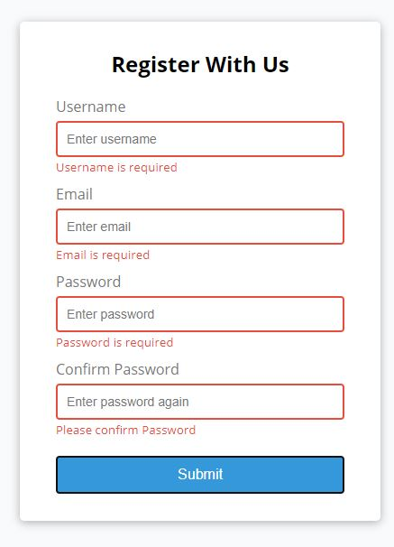

# Form Validator

Some resources:

Validate email [using regex:](https://stackoverflow.com/questions/46155/how-to-validate-an-email-address-in-javascript)

I don't do this too often [Cloning a repository](https://docs.github.com/en/free-pro-team@latest/github/creating-cloning-and-archiving-repositories/cloning-a-repository)

And here is the app made with a bit of CSS, Flexbox and JavaScript.  As it was JS practise I turned off the HTML5 validations and wrote it out in JS.

